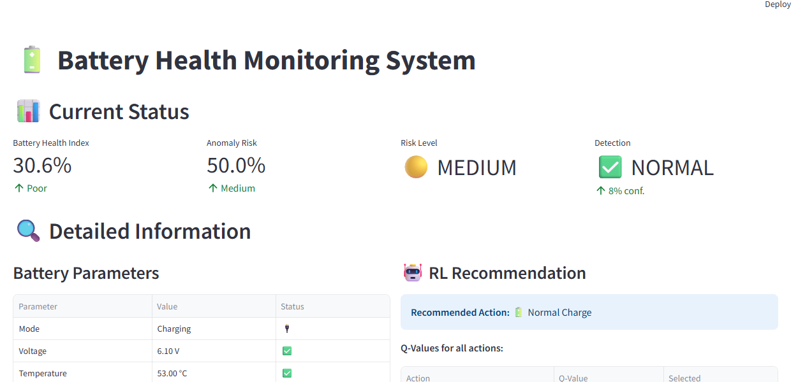
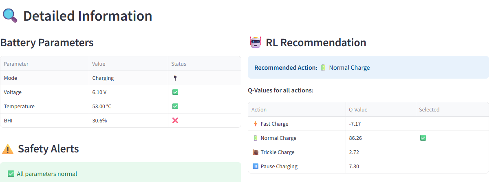
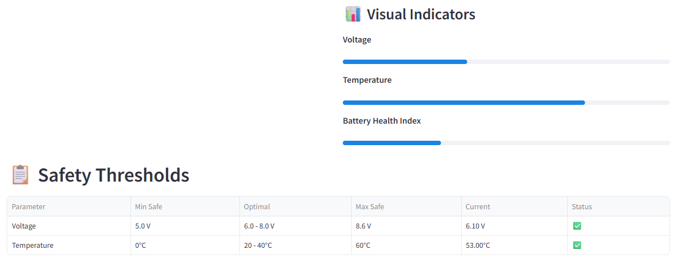
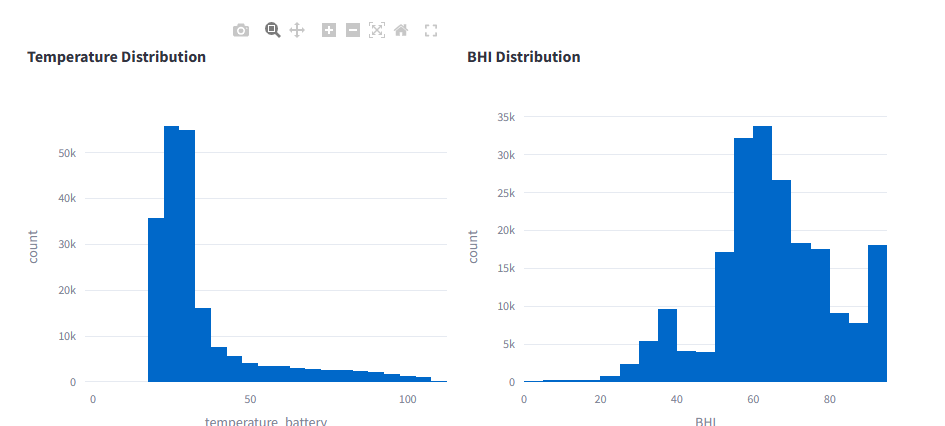
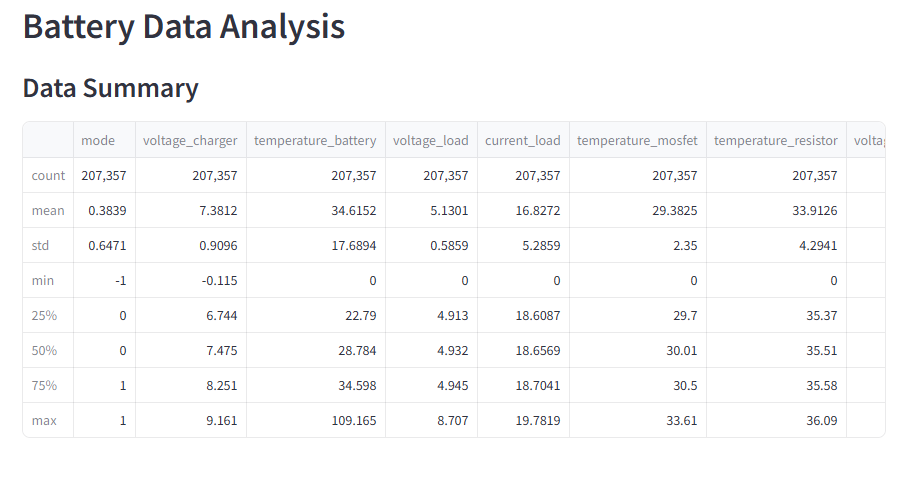

# 🔋 AI-Powered EV Battery Safety & Reliability System

[](https://www.python.org/)
[](https://xgboost.readthedocs.io/)
[](https://en.wikipedia.org/wiki/Q-learning)
[](https://streamlit.io/)
[](https://airflow.apache.org/)

> **VidyutAI Hackathon 2025 - Problem Statement**  
> A comprehensive data-driven backend system powered by AI/ML and Reinforcement Learning to predict EV battery safety risks, generate Battery Health Index (BHI), and recommend optimal charging strategies.


## 🎯 Problem Statement

India's EV adoption is accelerating with **1.7 million EVs sold in FY 2023–24** and a target of **30% penetration by 2030**. However, safety and reliability remain major barriers:

- ⚠️ **Thermal runaway** and fire hazards during fast charging
- 💧 **Water ingress** under humid/flood conditions
- 🌡️ **Climate diversity** stressing imported BMS systems
- 🔌 **Inconsistent charging standards** and limited diagnostics

### Objective

Develop an AI/ML-powered system to:
1. Predict battery safety risks and anomalies
2. Calculate real-time Battery Health Index (BHI)
3. Use Reinforcement Learning for optimal charging recommendations
4. Minimize long-term battery degradation

---

## 🚀 Solution Overview

Our system combines **XGBoost anomaly detection** with **Q-Learning Reinforcement Learning** to provide:

- 🔍 **Real-time anomaly detection** with 98.66% accuracy
- 📊 **Battery Health Index (BHI)** calculation (0-100 scale)
- 🤖 **RL-based charging recommendations** (Fast/Normal/Trickle/Pause)
- ⚡ **Risk classification** (Low/Medium/High)
- 🎯 **Actionable insights** for safe battery operation

---

## ✨ Key Features

### 1. **Anomaly Detection System (XGBoost)**
- Detects sudden voltage drops, rapid temperature rise, abnormal discharge patterns
- Processes **13 features** including voltage, temperature, current, and their derivatives
- Classifies severity into Low/Medium/High risk levels

### 2. **Battery Health Index (BHI)**
- Real-time health scoring (0-100)
- Considers voltage health (30%), temperature health (30%), stability (20%), anomaly-free operation (20%)
- Tracks battery degradation over time

### 3. **Reinforcement Learning Agent (Q-Learning)**
- **4 charging actions**: Fast Charge, Normal Charge, Trickle Charge, Pause Charging
- **Reward function** balances charging speed with safety
- Learns to avoid risky patterns (overheating, unsafe voltages)
- **747% reward improvement** over random policy
- **86% safety improvement** over aggressive charging

### 4. **ETL Pipeline (Apache Airflow)**
- Automated daily inference pipeline orchestration
- Feature engineering with derivative calculations
- Real-time XGBoost anomaly detection
- RL-based charging action recommendations
- Results aggregation and persistence
- Monitoring and alerting capabilities

### 5. **Interactive Dashboard (Streamlit)**
- Real-time battery monitoring
- Visual gauges for voltage and temperature
- RL-driven charging recommendations
- Safety alerts and threshold monitoring

---

## 🏗️ System Architecture

```
┌─────────────────────────────────────────────────────────────┐
│                    Data Ingestion Layer                     │
│  (CSV Files: Charge/Discharge Cycles, Environmental Data)   │
└──────────────────────┬──────────────────────────────────────┘
                       │
                       ▼
┌─────────────────────────────────────────────────────────────┐
│              ETL Pipeline (Apache Airflow DAG)               │
│                                                              │
│  ┌───────────────────────────────────────────────────────┐  │
│  │ Task 1: Feature Engineering                           │  │
│  │  • Load CSV data                                      │  │
│  │  • Select core features (7 features)                  │  │
│  │  • Calculate derivatives (voltage, temperature)       │  │
│  │  • Handle null values and normalization               │  │
│  └───────────────────────────────────────────────────────┘  │
│                        │                                     │
│                        ▼                                     │
│  ┌───────────────────────────────────────────────────────┐  │
│  │ Task 2: XGBoost Anomaly Detection                     │  │
│  │  • Load trained model                                 │  │
│  │  • Generate anomaly scores & predictions              │  │
│  │  • Calculate BHI (Battery Health Index)               │  │
│  │  • Classify risk levels (Low/Medium/High)             │  │
│  │  • Detect specific anomalies                          │  │
│  └───────────────────────────────────────────────────────┘  │
│                        │                                     │
│                        ▼                                     │
│  ┌───────────────────────────────────────────────────────┐  │
│  │ Task 3: RL Agent Prediction                           │  │
│  │  • Load Q-Learning model                              │  │
│  │  • Discretize battery states                          │  │
│  │  • Generate action recommendations                    │  │
│  │  • Map actions (STOP/TRICKLE/NORMAL/FAST)            │  │
│  └───────────────────────────────────────────────────────┘  │
│                        │                                     │
│                        ▼                                     │
│  ┌───────────────────────────────────────────────────────┐  │
│  │ Task 4: Results Aggregation                           │  │
│  │  • Combine all predictions                            │  │
│  │  • Generate summary statistics                        │  │
│  │  • Save JSON output for dashboard                     │  │
│  └───────────────────────────────────────────────────────┘  │
│                                                              │
└──────────────────────┬──────────────────────────────────────┘
                       │
                       ▼
           ┌────────────────────────┐
           │   Persistent Storage   │
           │   • Transformed Data   │
           │   • Anomaly Results    │
           │   • RL Actions         │
           │   • Summary JSON       │
           └────────────┬───────────┘
                        │
                        ▼
           ┌────────────────────────┐
           │   Streamlit Dashboard  │
           │                        │
           │  • Real-time Monitoring│
           │  • Recommendations     │
           │  • Safety Alerts       │
           │  • Historical Analysis │
           └────────────────────────┘
```

### ETL Pipeline Workflow

```
Battery Data (CSV)
        │
        ▼
   ┌─────────────┐
   │   Feature   │  → Normalized features + derivatives
   │ Engineering │
   └──────┬──────┘
          │
          ▼
   ┌─────────────────────┐
   │   XGBoost Model     │  → Anomaly scores + BHI + Risk
   │  Anomaly Detection  │
   └──────┬──────────────┘
          │
          ▼
   ┌─────────────────────┐
   │  Q-Learning Agent   │  → Charging actions (STOP/TRICKLE/NORMAL/FAST)
   │  RL Recommendation  │
   └──────┬──────────────┘
          │
          ▼
   ┌─────────────────────┐
   │   Results Summary   │  → JSON for Streamlit
   │   & Persistence    │
   └──────┬──────────────┘
          │
          ▼
   Dashboard Visualization
```

### ETL Pipeline (Apache Airflow)


---

## 📊 Results & Performance

### Dataset Statistics
- **Total Samples**: 53,519,162
- **Anomalies Detected**: 3,925,893 (7.34%)
- **Normal Operations**: 49,593,269 (92.66%)

### XGBoost Model Performance

| Metric | Value |
|--------|-------|
| **Accuracy** | 98.66% |
| **ROC-AUC Score** | 0.9994 |
| **Precision (Anomaly)** | 0.85 |
| **Recall (Anomaly)** | 1.00 |
| **F1-Score (Anomaly)** | 0.92 |

### Confusion Matrix (Battery Risk Classification)

|                | **Predicted: Safe** | **Predicted: Risk** |
|----------------|---------------------|---------------------|
| **Actual: Safe** | **9,778,159**  <br>_True Negatives_ | **140,495**  <br>_False Positives_ |
| **Actual: Risk** | **2,862**  <br>_False Negatives_ | **782,317**  <br>_True Positives_ |

**Summary**
- True Negatives: 9,778,159  
- True Positives: 782,317  
- False Positives: 140,495  
- False Negatives: 2,862

### Top 10 Feature Importance

| Feature | Importance |
|---------|------------|
| voltage_charger | 29.79% |
| temperature_battery | 13.65% |
| current_load_derivative | 11.44% |
| current_load | 10.05% |
| temperature_mosfet_derivative | 8.41% |
| voltage_charger_derivative | 7.38% |
| temperature_resistor_derivative | 6.45% |
| temperature_battery_derivative | 4.61% |
| mode | 3.77% |
| temperature_resistor | 1.79% |

### Reinforcement Learning Performance

| Policy | Avg Reward | Safety Violations | Avg BHI |
|--------|-----------|-------------------|---------|
| **RL Agent (Trained)** | 945.86 ± 500.67 | **4.14%** | **66.69** |
| Random Policy | -146.05 ± 1118.28 | 29.37% | 64.97 |
| Always Fast Charge | -147.30 ± 1118.87 | 29.43% | 64.97 |

#### RL Improvements
- **+747.64%** reward improvement over random policy
- **+85.90%** safety improvement (fewer violations)
- **+1.72** BHI preservation over aggressive charging

#### Learned Action Distribution
- Fast Charge: 0.01% (14 actions)
- Normal Charge: 12.63% (12,625 actions)
- Trickle Charge: 61.55% (61,550 actions) ⭐
- Pause Charging: 25.81% (25,811 actions)

---

## 🛠️ Installation

### Prerequisites
- Python 3.11+
- Docker & Docker Compose
- pip package manager

### Setup (Local Development)

1. **Clone the repository**
```bash
git clone https://github.com/yourusername/ev-battery-safety.git
cd ev-battery-safety
```

2. **Create virtual environment**
```bash
python -m venv venv
source venv/bin/activate  # On Windows: venv\Scripts\activate
```

3. **Install dependencies**
```bash
pip install -r requirements.txt
```

### Setup (Docker - Production)

1. **Initialize Astro project**
```bash
astro dev init
```

2. **Copy DAG file**
```bash
cp dags/battery_inference_pipeline.py dags/
```

3. **Start Airflow containers**
```bash
astro dev start
```
---

## 🎮 Usage

### 1. Training Models (Jupyter Notebook)

Open and run `solution.ipynb` to:
- Load and preprocess battery data
- Train XGBoost anomaly detection model
- Train Q-Learning RL agent
- Generate performance metrics and visualizations

### 2. Running ETL Pipeline (Airflow)

#### Start Airflow
```bash
astro dev start
```

#### Trigger DAG
1. Navigate to http://localhost:8080
2. Find **"battery_inference_pipeline"** DAG
3. Click the Play button to trigger
4. Monitor execution in real-time
5. View logs for debugging

#### Pipeline Stages
- **Stage 1**: Feature Engineering (5-10 seconds)
- **Stage 2**: XGBoost Anomaly Detection (10-15 seconds)
- **Stage 3**: RL Agent Prediction (5-10 seconds)
- **Stage 4**: Results Aggregation (2-5 seconds)

### 3. Running the Dashboard

```bash
streamlit run app.py
```

The dashboard will open in your browser at `http://localhost:8501`

### 4. Using the Dashboard

**Features:**
- Real-time battery monitoring
- Anomaly detection alerts
- RL-based charging recommendations
- Safety risk indicators
- Historical trend analysis
- Diagnostic system status

---

## 📁 Project Structure

```
├── VidyutAI Hackathon 2025 Problem Statement 1.pdf
├── app.py                          # Streamlit dashboard application
├── dags/
│   └── battery_inference_pipeline.py    # Airflow DAG for ETL
├── include/
│   ├── data/
│   │   └── battery20.csv          # Sample battery data
│   ├── models/
│   │   ├── q_learning_battery_model.pkl
│   │   └── xgboost_anomaly_model.json
│   └── results/
│       ├── transformed_data.csv
│       ├── anomaly_detected_data.csv
│       └── inference_results.json
├── docs/
│   ├── deployment/                # Images for streamlit application 
│   └── rl_agent/                  # Images of trained RL agent
├── requirements.txt
├── solution.ipynb                 # Complete solution notebook
└── README.md                      # This file
```

---

## 🔧 Technologies Used

### Machine Learning
- **XGBoost**: Gradient boosting for anomaly detection
- **Isolation Forest**: Initial anomaly labeling
- **Q-Learning**: Reinforcement Learning for charging policy

### Data Processing
- **Pandas**: Data manipulation and analysis
- **NumPy**: Numerical computations

### ETL & Orchestration
- **Apache Airflow**: DAG-based pipeline orchestration
- **Astronomer CLI**: Airflow development environment

### Visualization & Dashboard
- **Streamlit**: Interactive web dashboard
- **Plotly**: Interactive charts and gauges
- **Matplotlib**: Static visualizations

### Deployment
- **Docker**: Containerization
- **Docker Compose**: Multi-container orchestration

### Development Tools
- **Jupyter Notebook**: Model development and experimentation
- **Python 3.11**: Core programming language
- **Git**: Version control

---

## 📈 Model Details

### Feature Engineering

**Input Features (13 total):**
```python
feature_cols = [
    'mode',                              # Operating mode (-1: discharge, 0: idle, 1: charge)
    'voltage_charger',                   # Charger voltage (V)
    'temperature_battery',               # Battery temperature (°C)
    'voltage_load',                      # Load voltage (V) - discharge only
    'current_load',                      # Load current (A) - discharge only
    'temperature_mosfet',                # MOSFET temperature (°C) - discharge only
    'temperature_resistor',              # Resistor temperature (°C) - discharge only
    'voltage_charger_derivative',        # Rate of voltage change
    'temperature_battery_derivative',    # Rate of temperature change
    'voltage_load_derivative',           # Rate of load voltage change
    'current_load_derivative',           # Rate of current change
    'temperature_mosfet_derivative',     # Rate of MOSFET temp change
    'temperature_resistor_derivative'    # Rate of resistor temp change
]
```

### Hardcoded Safety Rules
- Temperature > 70°C or < -20°C → **Anomaly**
- Voltage < 5V or > 8.6V → **Anomaly**

### RL Reward Function

**Positive Rewards:**
- Stable temperature (20-40°C): +10
- Safe voltage (6-8V): +5
- High BHI (>80): +5
- Low anomaly probability (<0.3): +5
- Steady charging progress: +3

**Negative Rewards:**
- Overheating (>60°C): -25
- Extreme conditions: -50
- Unsafe voltage: -15
- High anomaly risk: -20
- Fast charging when hot: -20

---

## 📸 Screenshots

### Dashboard Overview


### Full Dashboard View


### RL Recommendations


### Visual Indicators


### Temperature and BHI Distribution


### Data Analysis


### RL Agent Training - Reward Progress


### Safety Violations Comparison


### Policy Comparison


---

## 🎯 Key Achievements

✓ **High Accuracy**: 98.66% anomaly detection accuracy  
✓ **Real-time Monitoring**: Battery health tracking with BHI  
✓ **Intelligent Recommendations**: RL-based optimal charging strategies  
✓ **Safety First**: 86% reduction in safety violations  
✓ **Automated Pipeline**: Apache Airflow for reliable ETL orchestration  
✓ **Scalable Architecture**: Modular design for easy integration  
✓ **User-Friendly Interface**: Interactive Streamlit dashboard  
✓ **Production Ready**: Docker containerization for deployment

---

## 📚 References

1. [NASA Battery Dataset](https://data.nasa.gov/dataset/li-ion-battery-aging-datasets)
2. [NREL Battery Failure Data](https://www.nrel.gov/transportation/battery-failure)
3. [XGBoost Documentation](https://xgboost.readthedocs.io/)
4. [Reinforcement Learning: Q-Learning](https://en.wikipedia.org/wiki/Q-learning)
5. [Apache Airflow Documentation](https://airflow.apache.org/)
6. [VidyutAI Hackathon 2025 Problem Statement](VidyutAI_Hackathon_2025_Problem_Statement_1.pdf)


---
