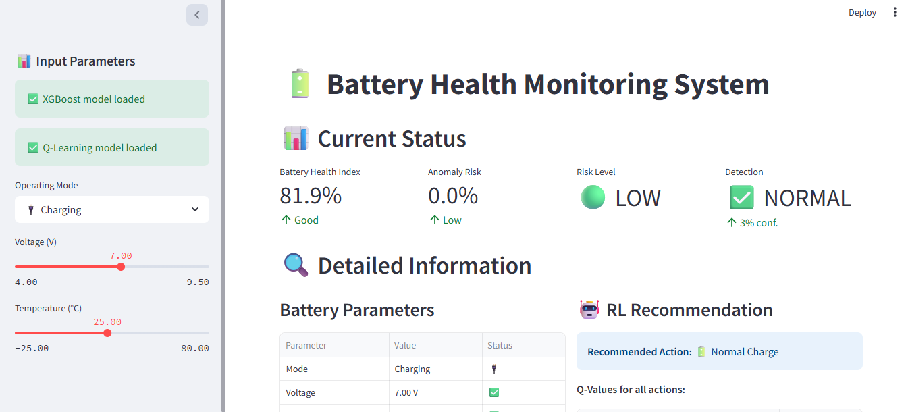
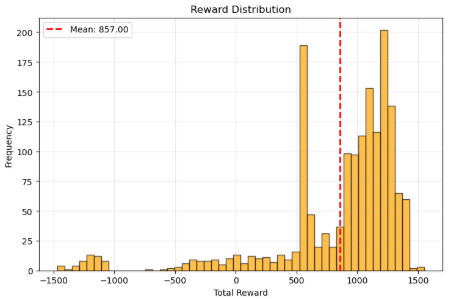
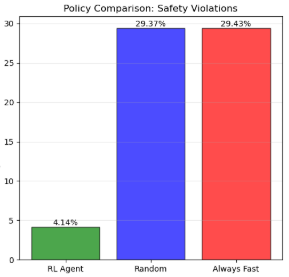
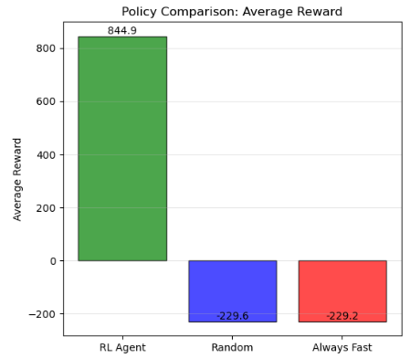

# 🔋 AI-Powered EV Battery Safety & Reliability System

[](https://www.python.org/)
[](https://xgboost.readthedocs.io/)
[](https://en.wikipedia.org/wiki/Q-learning)
[](https://streamlit.io/)

> **VidyutAI Hackathon 2025 - Problem Statement(#-problem-statement)**  
> A comprehensive data-driven backend system powered by AI/ML and Reinforcement Learning to predict EV battery safety risks, generate Battery Health Index (BHI), and recommend optimal charging strategies.


## 🎯 Problem Statement

India's EV adoption is accelerating with **1.7 million EVs sold in FY 2023–24** and a target of **30% penetration by 2030**. However, safety and reliability remain major barriers:

- ⚠️ **Thermal runaway** and fire hazards during fast charging
- 💧 **Water ingress** under humid/flood conditions
- 🌡️ **Climate diversity** stressing imported BMS systems
- 🔌 **Inconsistent charging standards** and limited diagnostics

### Objective

Develop an AI/ML-powered system to:
1. Predict battery safety risks and anomalies
2. Calculate real-time Battery Health Index (BHI)
3. Use Reinforcement Learning for optimal charging recommendations
4. Minimize long-term battery degradation

---

## 🚀 Solution Overview

Our system combines **XGBoost anomaly detection** with **Q-Learning Reinforcement Learning** to provide:

- 🔍 **Real-time anomaly detection** with 98.66% accuracy
- 📊 **Battery Health Index (BHI)** calculation (0-100 scale)
- 🤖 **RL-based charging recommendations** (Fast/Normal/Trickle/Pause)
- ⚡ **Risk classification** (Low/Medium/High)
- 🎯 **Actionable insights** for safe battery operation

---

## ✨ Key Features

### 1. **Anomaly Detection System (XGBoost)**
- Detects sudden voltage drops, rapid temperature rise, abnormal discharge patterns
- Processes **13 features** including voltage, temperature, current, and their derivatives
- Classifies severity into Low/Medium/High risk levels

### 2. **Battery Health Index (BHI)**
- Real-time health scoring (0-100)
- Considers voltage health (30%), temperature health (30%), stability (20%), anomaly-free operation (20%)
- Tracks battery degradation over time

### 3. **Reinforcement Learning Agent (Q-Learning)**
- **4 charging actions**: Fast Charge, Normal Charge, Trickle Charge, Pause Charging
- **Reward function** balances charging speed with safety
- Learns to avoid risky patterns (overheating, unsafe voltages)
- **747% reward improvement** over random policy
- **86% safety improvement** over aggressive charging

### 4. **Interactive Dashboard (Streamlit)**
- Real-time battery monitoring
- Visual gauges for voltage and temperature
- RL-driven charging recommendations
- Safety alerts and threshold monitoring

---

## 🏗️ System Architecture

```
┌─────────────────────────────────────────────────────────────┐
│                    Data Ingestion Layer                     │
│  (CSV Files: Charge/Discharge Cycles, Environmental Data)   │
└──────────────────────┬──────────────────────────────────────┘
                       │
                       ▼
┌─────────────────────────────────────────────────────────────┐
│                  Isolation Forest (Anomaly Detection)        │
│  • 5% contamination                                         │
│  • Initial labeling of abnormal data                        │
│  • Hardcoded threshold-based rules                          │
└──────────────────────┬──────────────────────────────────────┘
                       │
                       ▼
┌─────────────────────────────────────────────────────────────┐
│                  Feature Engineering                        │
│  • Derivative Calculation (voltage, temperature)             │
│  • Mode-based Feature Handling (Charge/Discharge/Idle)       │
│  • Null Value Management                                    │
└──────────────────────┬──────────────────────────────────────┘
                       │
                       ▼
            ┌──────────────────────┐
            │  XGBoost Anomaly     │
            │  Detection Model     │
            │                      │
            │  • 98.66% Accuracy   │
            │  • ROC-AUC: 0.9994   │
            └──────────┬───────────┘
                       │
                       ▼
           ┌────────────────────────┐
           │   BHI Calculation      │
           │   Risk Classification  │
           └────────────┬───────────┘
                        │
                        ▼
           ┌────────────────────────┐
           │  Q-Learning RL Agent   │
           │                        │
           │  • 4 Actions           │
           │  • Simulated Dynamics  │
           │  • 2000 Episodes       │
           └────────────┬───────────┘
                        │
                        ▼
           ┌────────────────────────┐
           │   Streamlit Dashboard  │
           │                        │
           │  • Real-time Monitoring│
           │  • Recommendations     │
           │  • Safety Alerts       │
           └────────────────────────┘
```

---

## 📊 Results & Performance

### Dataset Statistics
- **Total Samples**: 53,519,162
- **Anomalies Detected**: 3,925,893 (7.34%)
- **Normal Operations**: 49,593,269 (92.66%)

### XGBoost Model Performance

| Metric | Value |
|--------|-------|
| **Accuracy** | 98.66% |
| **ROC-AUC Score** | 0.9994 |
| **Precision (Anomaly)** | 0.85 |
| **Recall (Anomaly)** | 1.00 |
| **F1-Score (Anomaly)** | 0.92 |

### 🧩 Confusion Matrix (Battery Risk Classification)

|                | **Predicted: Safe** | **Predicted: Risk** |
|----------------|---------------------|---------------------|
| **Actual: Safe ✅** | **9,778,159**  <br>_True Negatives_ | **140,495**  <br>_False Positives_ |
| **Actual: Risk ⚠️** | **2,862**  <br>_False Negatives_ | **782,317**  <br>_True Positives_ |

**Summary**
- ✅ **True Negatives:** 9,778,159  
- ⚠️ **True Positives:** 782,317  
- ❌ **False Positives:** 140,495  
- 🚫 **False Negatives:** 2,862  

### Top 10 Feature Importance

| Feature | Importance |
|---------|------------|
| voltage_charger | 29.79% |
| temperature_battery | 13.65% |
| current_load_derivative | 11.44% |
| current_load | 10.05% |
| temperature_mosfet_derivative | 8.41% |
| voltage_charger_derivative | 7.38% |
| temperature_resistor_derivative | 6.45% |
| temperature_battery_derivative | 4.61% |
| mode | 3.77% |
| temperature_resistor | 1.79% |

### Reinforcement Learning Performance

| Policy | Avg Reward | Safety Violations | Avg BHI |
|--------|-----------|-------------------|---------|
| **RL Agent (Trained)** | 945.86 ± 500.67 | **4.14%** | **66.69** |
| Random Policy | -146.05 ± 1118.28 | 29.37% | 64.97 |
| Always Fast Charge | -147.30 ± 1118.87 | 29.43% | 64.97 |

#### RL Improvements
- ✅ **+747.64%** reward improvement over random policy
- ✅ **+85.90%** safety improvement (fewer violations)
- ✅ **+1.72** BHI preservation over aggressive charging

#### Learned Action Distribution
- Fast Charge: 0.01% (14 actions)
- Normal Charge: 12.63% (12,625 actions)
- Trickle Charge: 61.55% (61,550 actions) ⭐
- Pause Charging: 25.81% (25,811 actions)

> **Key Insight**: The RL agent learned to prefer safer Trickle Charge and strategic Pause actions over aggressive Fast Charge.

---

## 🛠️ Installation

### Prerequisites
- Python 3.11+
- pip package manager

### Setup

1. **Clone the repository**
```bash
git clone https://github.com/yourusername/ev-battery-safety.git
cd ev-battery-safety
```

2. **Create virtual environment** (recommended)
```bash
python -m venv venv
source venv/bin/activate  # On Windows: venv\Scripts\activate
```

3. **Install dependencies**
```bash
pip install -r requirements.txt
```

### Required Dependencies
```txt
pandas
numpy
scikit-learn
xgboost
streamlit
plotly
matplotlib
```

---

## 🎮 Usage

### 1. Training Models (Jupyter Notebook)

Open and run `solution.ipynb` to:
- Load and preprocess battery data
- Train XGBoost anomaly detection model
- Train Q-Learning RL agent
- Generate performance metrics and visualizations

### 2. Running the Dashboard

```bash
streamlit run app.py
```

The dashboard will open in your browser at `http://localhost:8501`

### 3. Using the Dashboard

**Inputs:**
- Select **Operating Mode** (Charging/Idle/Discharging)
- Adjust **Voltage** slider (4.0V - 9.5V)
- Adjust **Temperature** slider (-25°C - 80°C)

**Outputs:**
- Battery Health Index (BHI)
- Anomaly Detection Result
- Risk Level Classification
- RL Charging Recommendation (in Charging mode)
- Safety Alerts and Warnings

---

## 📁 Project Structure

```
├── VidyutAI Hackathon 2025 Problem Statement 1.pdf
├── app.py                          # Streamlit dashboard application
├── docs/
│   ├── deployment/                 # Deployment screenshots
│   │   ├── 1.png
│   │   ├── 2.png
│   │   ├── 3.png
│   │   └── 4.png
│   └── rl_agent/                   # RL training visualizations
│       ├── exploration_rate.png
│       ├── policy.png
│       ├── reward2.png
│       ├── reward_1.png
│       └── violations.png
├── q_learning_battery_model.pkl    # Trained Q-Learning model
├── solution.ipynb                  # Complete solution notebook
├── xgboost_anomaly_model.json      # XGBoost model (JSON format)
├── xgboost_anomaly_model.pkl       # XGBoost model (Pickle format)
└── README.md                       # This file
```

---

## 🔧 Technologies Used

### Machine Learning
- **XGBoost**: Gradient boosting for anomaly detection
- **Isolation Forest**: Initial anomaly labeling
- **Q-Learning**: Reinforcement Learning for charging policy

### Data Processing
- **Pandas**: Data manipulation and analysis
- **NumPy**: Numerical computations

### Visualization & Dashboard
- **Streamlit**: Interactive web dashboard
- **Plotly**: Interactive charts and gauges
- **Matplotlib**: Static visualizations

### Development Tools
- **Jupyter Notebook**: Model development and experimentation
- **Python 3.11**: Core programming language
- **Git**: Version control

---

## 📈 Model Details

### Feature Engineering

**Input Features (13 total):**
```python
feature_cols = [
    'mode',                              # Operating mode (-1: discharge, 0: idle, 1: charge)
    'voltage_charger',                   # Charger voltage (V)
    'temperature_battery',               # Battery temperature (°C)
    'voltage_load',                      # Load voltage (V) - discharge only
    'current_load',                      # Load current (A) - discharge only
    'temperature_mosfet',                # MOSFET temperature (°C) - discharge only
    'temperature_resistor',              # Resistor temperature (°C) - discharge only
    'voltage_charger_derivative',        # Rate of voltage change
    'temperature_battery_derivative',    # Rate of temperature change
    'voltage_load_derivative',           # Rate of load voltage change
    'current_load_derivative',           # Rate of current change
    'temperature_mosfet_derivative',     # Rate of MOSFET temp change
    'temperature_resistor_derivative'    # Rate of resistor temp change
]
```

### Hardcoded Safety Rules
- Temperature > 70°C or < -20°C → **Anomaly**
- Voltage < 5V or > 8.6V → **Anomaly**

### RL Reward Function

**Positive Rewards:**
- Stable temperature (20-40°C): +10
- Safe voltage (6-8V): +5
- High BHI (>80): +5
- Low anomaly probability (<0.3): +5
- Steady charging progress: +3

**Negative Rewards:**
- Overheating (>60°C): -25
- Extreme conditions: -50
- Unsafe voltage: -15
- High anomaly risk: -20
- Fast charging when hot: -20

---

## 📸 Screenshots

### Dashboard Overview


### RL Agent Training




---

## 🎯 Key Achievements

✅ **High Accuracy**: 98.66% anomaly detection accuracy  
✅ **Real-time Monitoring**: Battery health tracking with BHI  
✅ **Intelligent Recommendations**: RL-based optimal charging strategies  
✅ **Safety First**: 86% reduction in safety violations  
✅ **Scalable Architecture**: Modular design for easy integration  
✅ **User-Friendly Interface**: Interactive Streamlit dashboard  


## 📚 References

1. [NASA Battery Dataset](https://data.nasa.gov/dataset/li-ion-battery-aging-datasets)
2. [NREL Battery Failure Data](https://www.nrel.gov/transportation/battery-failure)
3. [XGBoost Documentation](https://xgboost.readthedocs.io/)
4. [Reinforcement Learning: Q-Learning](https://en.wikipedia.org/wiki/Q-learning)
5. VidyutAI Hackathon 2025 Problem Statement(#-problem-statement)

---

## 🤝 Contributing

Contributions are welcome! Please feel free to submit a Pull Request.

1. Fork the repository
2. Create your feature branch (`git checkout -b feature/AmazingFeature`)
3. Commit your changes (`git commit -m 'Add some AmazingFeature'`)
4. Push to the branch (`git push origin feature/AmazingFeature`)
5. Open a Pull Request

---
<div align="center">

**⭐ Star this repository if you found it helpful!**

Made with ❤️ for VidyutAI Hackathon 2025

</div>
